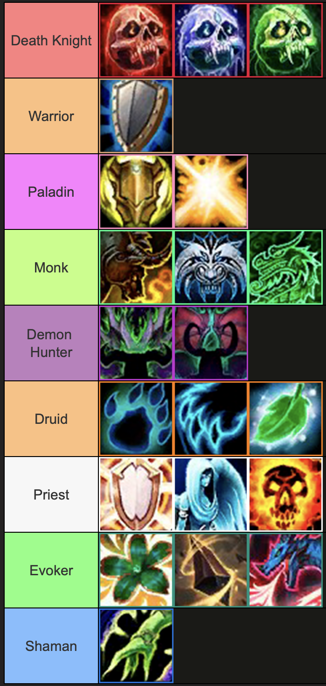
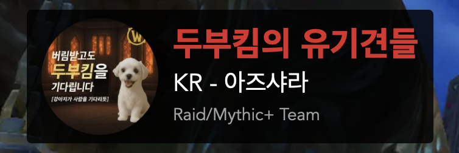

# **잠탱이**

**Contact info**  

> YouTube: [Slumber](https://www.youtube.com/@Slumber957)  
> Battle Tag: Slumber#31209

## About Me
아즈샤라 서버에서 게임하는 잠탱이 입니다.

 

제가 플레이 가능한 직업 및 전문화 입니다.

해당 직업들은 공대에 필요한 포지션이라면 스왑도 언제든 가능합니다.

와우 이론가로써 메타 분석과 Warcraftlogs api를 이용한 전문가 수준의 로그 분석을 진행하고 있습니다.

## Guild
### **두부킴의 유기견들**

 

- / [wcl](https://www.warcraftlogs.com/guild/id/779093) / [ProgStats](https://progstats.io/details/kr/azshara/779093-/all/44-manaforge-omega)
- Guild Progression Video Links
   - 잠탱이(RL): [잠탱이, Tanker](https://www.youtube.com/@Slumber957)
   - 두부킴: [두무킴, Healer](https://chzzk.naver.com/56a68f749a286025b6cefd5d2cb3f53a)
   - Keez: [만보먹고, RDps](https://www.youtube.com/@keez3625)
   - 후제: [후제, Rdps](https://www.youtube.com/@rouget.)
   - 보솜이: [보소밍, Rdps](https://www.youtube.com/@보솜이-c7c)
   - 특임: [특임, Rdps](https://www.youtube.com/@ShiyeolLee)

### Guild History
용군단 2시즌 아베루스: 공격대장 두부킴을 필두로 공격대 창설, 주 1일 4탐 파티로 진행  
용군단 3시즌 아미드랏실: 주 1일 4탐 파티로 진행  
용군단 4시즌 각성: 주 1일 4탐 파티로 진행  

내부전쟁 1시즌 네룹아르 궁전: 주 2일 8탐 파티로 진행  
내부전쟁 2시즌 언더마인 해방전선: 공격대장 잠탱이로 변경, 주 2일 8탐 파티로 진행  
내부전쟁 3시즌 마나괴철로 종극점: 두부킴의 유기견들 길드 창설, 주 1일 4탐 파티로 진행

한밤 1시즌: **TBD**

## Characters

- 수도잠탱이 (Brewmaster Monk) / [wcl](https://www.warcraftlogs.com/character/id/71983202) / [raider](https://raider.io/characters/kr/azshara/%EC%88%98%EB%8F%84%EC%9E%A0%ED%83%B1%EC%9D%B4)
- 죽기싫은잠탱이 (Blood Deathknight) / [wcl](https://www.warcraftlogs.com/character/id/72068316) / [raider](https://raider.io/characters/kr/azshara/%EC%A3%BD%EA%B8%B0%EC%8B%AB%EC%9D%80%EC%9E%A0%ED%83%B1%EC%9D%B4)
- 기사잠탱이 (Protection Paladin) / [wcl](https://www.warcraftlogs.com/character/id/71689323) / [raider](https://raider.io/characters/kr/azshara/%EA%B8%B0%EC%82%AC%EC%9E%A0%ED%83%B1%EC%9D%B4)
- 전사잠탱이 (Protection Warrior) / [wcl](https://www.warcraftlogs.com/character/id/71863854) / [raider](https://raider.io/characters/kr/azshara/%EC%A0%84%EC%82%AC%EC%9E%A0%ED%83%B1%EC%9D%B4)
- 하리보잠탱이 (Guardian Druid) / [wcl](https://www.warcraftlogs.com/character/id/72384124) / [raider](https://raider.io/characters/kr/azshara/%ED%95%98%EB%A6%AC%EB%B3%B4%EC%9E%A0%ED%83%B1%EC%9D%B4)
- 악사잠탱이 (Vengence Demonhunter) / [wcl](https://www.warcraftlogs.com/character/id/72384116) / [raider](https://raider.io/characters/kr/azshara/%EC%95%85%EC%82%AC%EC%9E%A0%ED%83%B1%EC%9D%B4)
- 사제잠탱이 (Discipline/Holy Priest) / [wcl](https://www.warcraftlogs.com/character/id/71660977) / [raider](https://raider.io/characters/kr/azshara/%EC%82%AC%EC%A0%9C%EC%9E%A0%ED%83%B1%EC%9D%B4)
- 도마뱀잠탱이 (Augmentation/Perservation Evoker) / [wcl](https://www.warcraftlogs.com/character/id/73728261) / [raider](https://raider.io/characters/kr/azshara/%EB%8F%84%EB%A7%88%EB%B1%80%EC%9E%A0%ED%83%B1%EC%9D%B4)

## Raid History
Note that this raid history only wrote "**notable**" records. 
Every other characters which is not written is "**hidden**" in this page.
### **Legion (7.0)**
#### The Nighthold (7.2)
* 죽기싫은잠탱이 (10/10 H, *frost dk*)
**First raid**

#### Tomb of Sargeras (7.3)
* 하리보잠탱이 (9/9 H, *feral druid*)

#### Antorus, The Burning Throne (7.4)
* 하리보잠탱이 (3/11 M, *feral druid*)
**First Mythic raid**

### **Battle for Azeroth (8.0)**
#### Uldir (8.0)
* 수도잠탱이 (3/8 M)
**First tank for the raid**

#### Battle of Dazar'alor (8.1.5)
* 수도잠탱이 (3/9 M)

#### The Eternal Palace (8.2)
* 수도잠탱이 (4/8 M)

#### Ny'alotha (8.3)
* 수도잠탱이 (12/12 M)
**First Cutting Edge**
  * killed with 늑대단
* 죽기싫은잠탱이 (12/12 M)
  * killed with 와관학교

### **Shadowlands (9.0)**
#### Castle Nathria (9.0)
* 수도잠탱이 (10/10 M)
**Hall of Fame (World 25th, KR 1st, Alliance)**
  * killed with 와관학교
  * Sub Mic/ co-raid leader

#### Sanctum of Domination (9.1)
* 수도잠탱이 (10/10 M)
  * killed with 조류학회

#### Sepulcher of the First Ones (9.2)
* 수도잠탱이 (7/11 M)
  * killed with 조류학회
* 사제잠탱이 (11/11M)
  * killed with 라햐죽기

### **Dragonflight (10.0)**
#### Vault of the Incarnates (10.0)
* Every Characters (2/8 M)
  * killed with 부엉사제

#### Aberrus, the Shadowed Crucible (10.1)
* 수도잠탱이 (5/9 M)
  * killed with 부엉사제
  * **Raid Leader**
* 사제잠탱이 (9/9 M)
  * killed with 조류학회
* 기사잠탱이 (9/9 M, *holy paladin*)
  * killed with 조류학회
* 도마뱀잠탱이 (9/9 M)
  * killed with 사쿠라

#### Amirdrassil, the Dream's Hope (10.2)
* 수도잠탱이 (7/9 M)
  * killed with 부엉사제
  * **Raid Leader**
* 기사잠탱이 (9/9 M)
  * killed with 두부킴/Seeca

#### Awakened Season (10.2.7)
* 기사잠탱이 (9/9M, 8/8M, 8/8M)
  * killed with 두부킴/Seeca
  * **Sub-Mic**
* 악사잠탱이 (4/9M, 5/8M, 6/8M)
  * killed with 부엉사제
  * **Raid Leader** 

### **The War Within (11.0)**
#### Nerub'ar Palace (11.0)
* 기사잠탱이 (8/8M)
  * killed with 두부집
  * **Co Raid Leader**
    
#### Liberation of Undermine (11.1)
* 기사잠탱이 (8/8M)
  * killed with 두부집
  * **Raid Leader**
* 수도잠탱이 (8/8M)
  * killed with Rinz
  * **Co Raid Leader**
    
#### Manaforge Omega (11.2)
* 전사잠탱이 (7/8M)
  * Progression in 두부킴의 유기견들
  * **Raid Leader**

### **Midnight (12.0)**
* **TBD**

## Filmography
- 가족공격대 시즌3: 한 여름밤의 캠프 (2024.7), 멘티 (팀 [RenieHouR](https://www.youtube.com/@RenieHouR))
  - [Episode 1](https://www.youtube.com/watch?v=OFYB9EQ4m1o)
  - [Episode 2](https://www.youtube.com/watch?v=HCI_8XR2lDY)
  - [Episode 3](https://www.youtube.com/watch?v=f0DiVhOOV9c)

