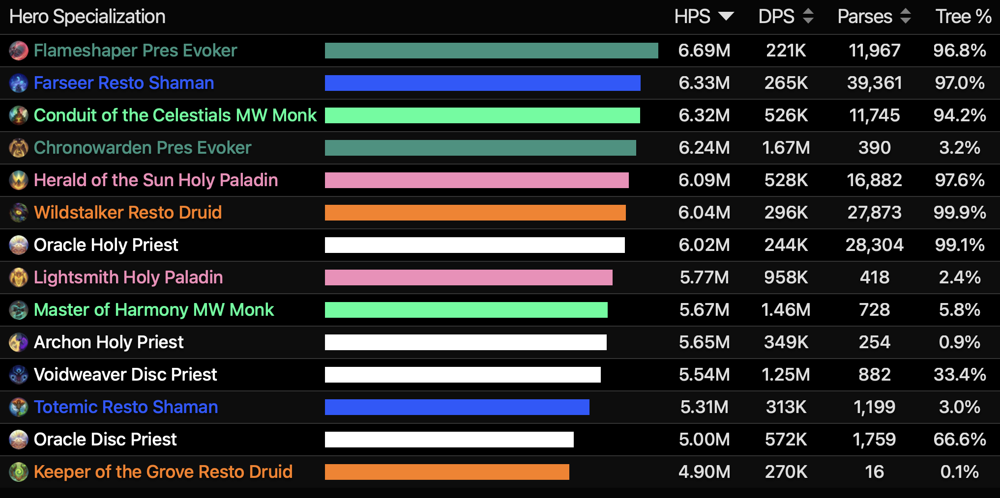
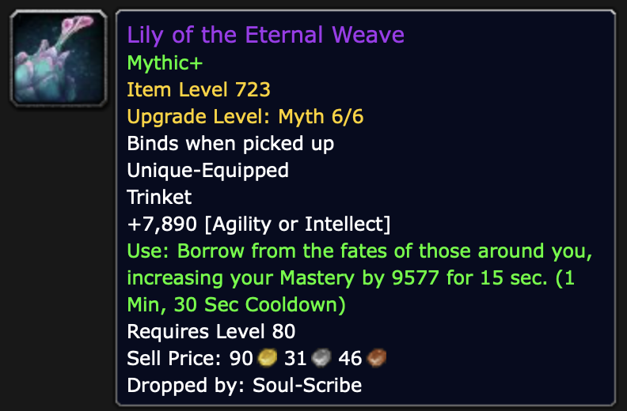
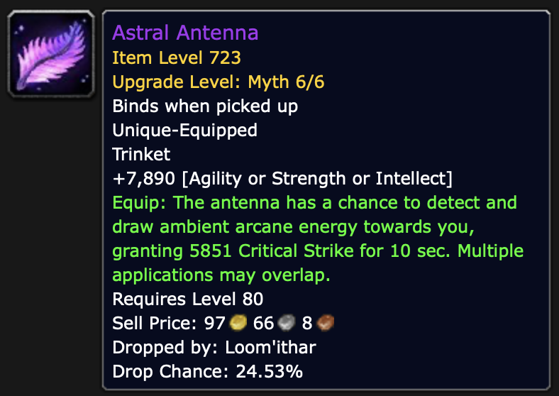
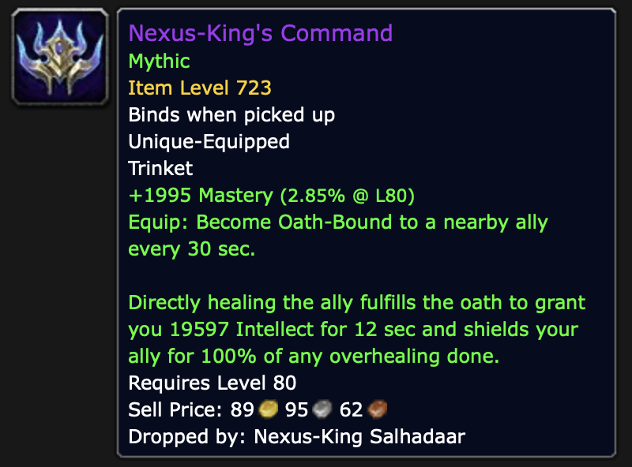
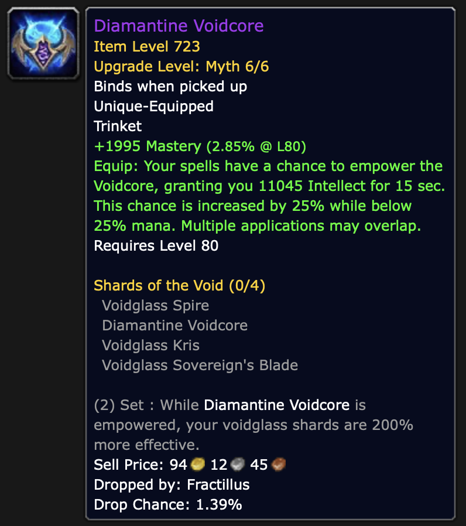

# 내부전쟁 3시즌 메타

&nbsp;  게임은 즐기려고 하는 것이다.
그렇기에 게임을 플레이 할때 현재 제일 좋은 직업을 플레이 하거나 본인이 선호하는 직업을 하기 마련이다.
가장 좋은 직업을 플레이 하기 이전에 해당 직업들이 이번 시즌에 **왜** 좋은지 그 이유를 알아보자는 취지에서 이 글을 작성하게 되었다.

## 2. 힐러

&nbsp;  지난 탱커편에 이어 이번에는 힐 메타에 대해 분석해보도록 한다.
주관적인 판단에 있어서 레이드에서 가장 어려운 직종은 **힐러** 라고 생각된다.
난이도적인 상황만 보더라도 힐러 >> 딜러 >> 탱커 순으로 난이도가 어렵다.

&nbsp;  레이드는 20명이 같이 푸는 퍼즐 게임이다.
탱커의 경우, 거의 모든 패턴 파홰 담당에서 배제되는 경우가 많다.
딜러의 경우, 본인의 생존정도만 생각하면서 넴드에 딜을 하며 패턴을 파홰하면 된다.
그러나 힐러의 경우, 본인의 생존은 당연하고 나머지 19명의 생존까지 책임지면서 딜러와 같은 난이도의 패턴 파홰를 해야 한다.
20명의 체력을 책임지려면 당연히 네임드의 패턴을 어느 시점에 어느 스킬을 써야 하는지도 알아야 같은 타이밍에 힐을 줄 수 있다.
공대장 만큼의 공략 이해와 더불어 피지컬적으로도 딜러만큼의 퍼포먼스를 보여줘야 1인분 하는 힐러가 되는 것이다.

&nbsp;  본인이 속한 공격대가 딜이 낮다면, 어느 정도의 최적화 또는 힐러들의 딜지원을 통해 dps를 올릴 수 있다.
그러나 본인이 속한 공격대가 hps가 낮다면, 그건 기어 파밍이 더 되야 하거나, 힐러들이 네임드 패턴에 대한 적응을 더 해야 한다.
공격대의 hps가 높으면 그만큼 공격대의 진도가 빠르다는 뜻이다.
그만큼 이 게임의 힐러들의 역할은 그 누구보다도 중요하다.

&nbsp;  월드 오브 워크래프트 에서의 힐러는 두 종류가 존재한다.
첫째, 특정 대상에게 큰 힐을 주는 유형 일명 찍힐 힐러.
둘째, 공격대 전체에게 순간적으로 강한 힐을 줄 수 있는 광힐 힐러.
공대에 광힐형 힐러가 많다면 당연히 디버프 대상자들의 힐을 주기 힘들 것이고, 찍힐형 힐러가 많다면 공대에 광역 피해가 들어올때 한두명씩 생존을 못해 죽는 경우가 발생한다.
그러므로 레이드 구조에 따라서 힐러의 종류를 결정해야 한다.
힐러도 탱커와 마찬가지로 딜 퍼포먼스가 낮은 딜러가 있다면, 그 시너지를 매꾸는 용도로도 직업 선택이 가능하다.
Race to World First 대회에서는 이 모든 것을 고려하여 조합을 짜게 된다.
 
 

&nbsp;  7종류의 힐러 중에서 찍힐형 힐러에는 **신성 사제**, **신성 기사**, **복원 주술사**가 존재한다.
보통의 경우 복원 주술사는 광힐형 힐러로 분류되지만, 현 메타에서는 복원 주술사가 선견자 영웅 특성을 선택함으로써 찍힐을 담당하게 되었다.
현 메타에서는 두 그룹으로 나누어 패턴을 파홰하는 네임드들이 많다.
이런 소규모 그룹 힐링의 경우, 복원 주술사와 신성 성기사가 그 성능이 신성 사제에 비해 압도적으로 좋다.
신성 사제가 힐량이 좋다고 해도 복원 주술사의 정신 고리 토템, 신성 성기사의 오라 숙련을 압도할 정도가 아니라면 그 채용률이 높지 않다.

&nbsp;  광힐형 힐러에는 **보존 기원사**, **수양 사제**, **회복 드루이드**, **운무 수도사**가 있다.
이 그룹에 속한 힐러들의 경우 1분~1분 30초의 쿨기 능력들의 폭발성이 중요하다.
이번 시즌은 보존 기원사의 정지장 콤보(꿈숨 업화 업화; 플레이어마다 다를 수 있음)가 압도적으로 좋기에 2보존을 사용하는 공격대가 굉장히 많았다.
보존 기원사는 이번시즌 메타픽이다.
8넴 디멘시우스에서도 와류가 2개 이상 필요하였고, 업화의 버프로 인해 정지장의 힐량이 직전 시즌과 비교하여 눈에 띄게 향상되었다.
운무 수도사의 경우 힐량은 준수하다.
그러나 그 고질적인 마나 문제와 같은 직업군의 양조 수도사와 풍운 수도사의 체급이 좋기 때문에 기용하지 않았다.
수양 사제는 암울하다.
수양 사제는 보존 기원사와 반대되는 위치에 있다.
수양 사제가 기용되면 보존 기원사는 기용되지 않고, 보존 기원사가 기용되면 수양 사제가 기용되지 않는다.
수양 사제도 마찬가지로 긴 전투시간 때문에 생기는 마나 문제가 해결되지 않았다.
그러나 티어 효과와 쿨기 타이밍(사도)에 그 폭발력은 보존 기원사에 뒤쳐지지 않을 정도로 강력하다.
마지막으로 회복 드루이드는 사실상 시너지를 해결하기 위한 픽이다.
물론 쿨기(번성) 힐량이 약한것은 아니지만 위에 나열된 힐러들보다는 약한 편이다.
베이스 힐러의 대표주자로써 위의 힐러들의 쿨기가 없을 때 공대의 전체적인 체력 관리를 해준다.
 
 
 

 
 

> **NOTE**
> 찍힐형 힐러들은 연합왕 장신구를 사용하지만 광힐형 힐러들은 2차스텟 장신구를 선호한다.

&nbsp;  힐러들의 장신구는 2차 스텟이 올라가는 장신구를 많이 채용한다.
2차 스텟이 올라가는 소레아의 은밀한 기술 이나, 은하수의 더듬이, 영원한 직조의 백합 장신구가 이에 해당한다.
수양 사제의 경우, 치명타와 특화도 장신구 효과를 받으면 좋기에 돌출부 장신구도 많이 채용하고 있다.
찍힐형 힐러의 경우, 7넴 살라다르가 드랍하는 연합왕의 망령 장신구가 아주 좋은 성능을 발휘한다.
모든 힐러들의 고민인 초과 치유량을 보호막으로 전환시켜 주게 되어 찍힐의 효과를 극대화 시킬 수 있다.
레이드에서 드랍하는 공허핵 장신구의 경우, 세트 효과가 있으면 고점의 힐량을 보여주지만 1차 스텟의 효율이 좋지 않은 시즌이기에 많은 채용을 하지 않는 모습이다.

